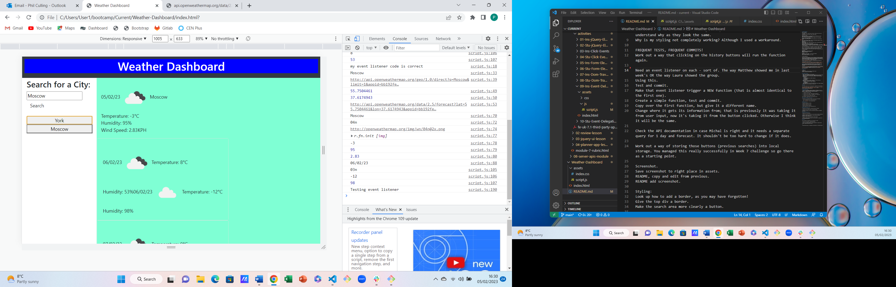

# Weather-Dashboard
Week 8 Challenge

Further practice with JavaScript and jQuery
## Description
I wanted to create a weather dashboard.
I wanted the dashboard to have an option for the user to input their city of choice.
After the user had clicked on "Search", I wanted the dashboard to display weather information for the current day and next 5 days for that location.
I wanted the dashboard to clear and show information for a different city when the user updated their input.
I wanted the previous user inputs to be saved as buttons.
I wanted the saved buttons to be able to be selected by the user and update the browser with weather information when clicked on.
I wanted the app to store the user input information into local storage such that it would continue to appear on refresh.
I wanted to practise use of APIs and jQuery to achieve this, especially functions, the use of .on('click') and local storage.
I wanted to deploy my finished product and check it had no errors.

## Installation
n/a

## Usage
When the website is viewed, the user can search for a city. After entering the name of the city and clicking on 'Search' the user will see weather information for that city, both today's information and a 5-day forecast. The user can add other cities to view more weather information. The user's search history is saved on screen as buttons. The buttons can be clicked on and the browser will refresh and update with weather information for that city.

Site is published at https://philculling.github.io/Weather-Dashboard 

Screenshot:

## Credits
Some help was provided by a tutor session.

## License
Please refer to the LICENSE in the repo.

NOTES START HERE

If you need a break, read the blog on API keys. Anthony sent this and it's in the README of the instructions.

Things to ask tutor:
How to use the event listener on the buttons to update the content.
Issues:
1. The function will be almost the same, but the call to the API will be based on the button just clicked not the user input. I need to get this right first before adapting the VERY LONG function.
2. Once sorted, adapt the function.
3. When I want to clear, it's clearing #today but not #forecast and I don't understand why as they look the same.
4. setItems is working fine, getItems is not, which is why it's commented out.
5. Why is my styling not completely working? Although I used a workaround.

FREQUENT TESTS, FREQUENT COMMITS!

UNRESOLVED ISSUES
Think about the clearing bit and why that's not working

Think more about what you need the function to do - the one where you click on the history buttons.
Devising a function for clicking on the history buttons and a correct, adapted function being called which works.
Function getItems to take the array back from local storage.
Make sure getItems is triggered when it needs to be.
Styling:
Look up how to add a border, as you may have forgotten!
Give the top div a border.

MY NOTES FINISH HERE